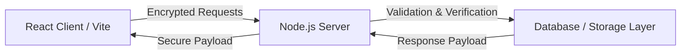

# 🔐 Secure Notes Platform

> A privacy-first, full-stack application designed for creating, storing, and managing encrypted notes with robust security standards.

[](https://www.typescriptlang.org/)
[](https://reactjs.org/)
[](https://vitejs.dev/)
[](https://nodejs.org/)
[](https://eslint.org/)

---

## 📸 Visual Preview

> 💡 **App Screenshot Placeholder**: Add a screenshot of your running application at `docs/preview.png` to replace this placeholder.
> 
> 

---

## ✨ Features

- 🔒 **End-to-End Security**: Built with strong encryption principles to keep user notes private and safe.
- ⚡ **Blazing Fast UI**: Powered by **React** and **Vite** for seamless component rendering and lightning-quick HMR.
- 🛠️ **Type Safe**: Developed using end-to-end **TypeScript** across both client and server layers.
- 🎨 **Modern Interface**: Intuitive design for effortlessly creating, tagging, and organizing sensitive notes.
- 🖥️ **Full-Stack Architecture**: Separate frontend client (`src/`) and Node backend environment (`server/`).

---

## 🏗️ Architecture & Data Flow



---

## 🛠️ Tech Stack

- **Frontend**: React, TypeScript, Vite
- **Backend**: Node.js
- **Tooling & Code Quality**: ESLint, TypeScript Compiler (`tsc`)
- **Package Manager**: npm

---

## 🚀 Quick Start

### Prerequisites

- **Node.js** (v18.x or higher recommended)
- **npm** (v9.x or higher)

### Installation & Setup

1. **Clone the repository**:
   ```bash
   git clone https://github.com/auysh8/secure-notes-platform.git
   cd secure-notes-platform
   ```

2. **Install dependencies**:
   ```bash
   npm install
   ```

3. **Run the development servers**:
   
   - **Start Frontend (Vite)**:
     ```bash
     npm run dev
     ```
   
   - **Start Server**:
     ```bash
     npm run server
     # or navigate to server directory if applicable
     cd server && npm start
     ```

4. **Build for production**:
   ```bash
   npm run build
   ```

---

## ⚙️ Environment Variables

Create a `.env` file in the root and/or `server` directory as required by your runtime environment:

```env
# Server Configuration
PORT=5000
NODE_ENV=development

# Security / Encryption Secrets
SECRET_KEY=your_super_secret_encryption_key
```

---

## 🤝 Contributing

Contributions, issues, and feature requests are welcome!

1. Fork the Project
2. Create your Feature Branch (`git checkout -b feature/AmazingFeature`)
3. Commit your Changes (`git commit -m 'Add some AmazingFeature'`)
4. Push to the Branch (`git push origin feature/AmazingFeature`)
5. Open a Pull Request

---

## 📄 License

This project is licensed under the MIT License - see the `LICENSE` file for details.