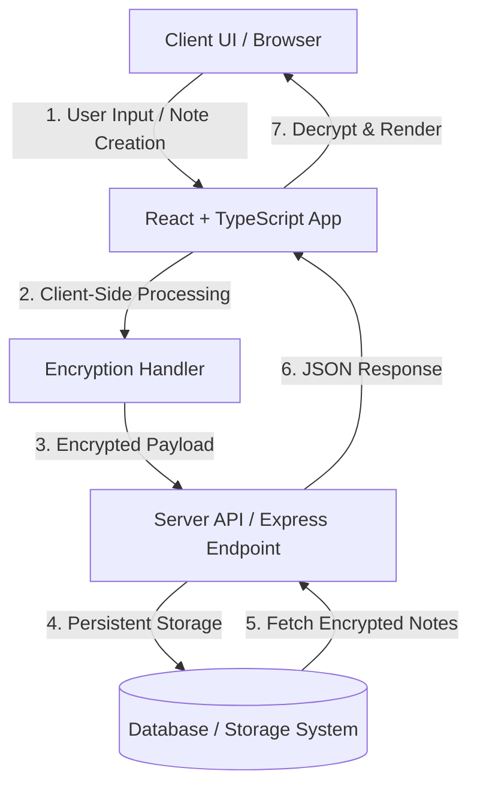

# Secure Notes Platform 🔒

An encrypted, privacy-focused web application engineered for secure creation, management, and storage of sensitive notes and private data.

[](https://www.typescriptlang.org/)
[](https://reactjs.org/)
[](https://vitejs.dev/)
[](https://nodejs.org/)
[](https://eslint.org/)

---

## 📸 Visual Preview

> 💡 Add a screenshot of your app at `docs/preview.png` to display it here.


---

## ✨ Features

- 🔐 **End-to-End Security:** Encrypts sensitive note content to safeguard data against unauthorized access.
- ⚡ **High Performance Frontend:** Built with React 18, TypeScript, and Vite for instant build times and responsive rendering.
- 🗂️ **Organized Workspace:** Efficiently categorize, filter, and structure notes for seamless retrieval.
- 🔍 **Real-Time Client Search:** Perform immediate client-side query indexing across all notes.
- 🛡️ **Full Type Safety:** Written end-to-end in strict TypeScript to catch errors at compile time.
- 🎨 **Responsive Interface:** Adaptive web design ensuring smooth usability across desktop, tablet, and mobile browsers.

---

## 📂 Repository Structure

```
secure-notes-platform/
├── public/                  # Static assets
├── server/                  # Backend application services & API routes
├── src/                     # React frontend source code
├── .gitignore               # Git untracked pattern definitions
├── eslint.config.js         # ESLint code quality configuration
├── index.html               # Application entry HTML page
├── package.json             # Node dependencies and npm script definitions
├── package-lock.json        # Dependency lockfile
├── tsconfig.app.json        # TypeScript configuration for application logic
├── tsconfig.json            # Base TypeScript configuration
├── tsconfig.node.json       # TypeScript configuration for Node environment
└── vite.config.ts           # Vite bundler configuration
```

---

## 🏗️ Architecture & Data Flow



---

## 🛠️ Tech Stack

| Category | Technologies |
| --- | --- |
| **Frontend Framework** | React, TypeScript, Vite |
| **Backend / Server** | Node.js |
| **Code Quality & Tooling** | ESLint, TypeScript Compiler (`tsc`) |
| **Build System** | Vite |

---

## 🚀 Quick Start

### Prerequisites

- **Node.js**: v18.0.0 or higher
- **npm**: v9.0.0 or higher

### Installation & Setup

1. **Clone the Repository**
   ```bash
   git clone https://github.com/auysh8/secure-notes-platform.git
   cd secure-notes-platform
   ```

2. **Install Dependencies**
   ```bash
   npm install
   ```

3. **Start Development Server**
   ```bash
   npm run dev
   ```

   Open your browser and navigate to `http://localhost:5173`.

---

## 📖 Available Scripts

Run these commands using `npm run <script-name>`:

| Script | Command | Description |
| --- | --- | --- |
| `dev` | `vite` | Launches the Vite local development server with hot module replacement (HMR) |
| `build` | `tsc -b && vite build` | Runs TypeScript type-checks and bundles the application for production |
| `lint` | `eslint .` | Scans source files for syntax errors and formatting standard violations |
| `preview` | `vite preview` | Serves the production build locally for verification |

---

## 🤝 Contributing

Contributions, issues, and feature requests are welcome!

1. **Fork** the repository
2. **Create** a feature branch (`git checkout -b feature/AmazingFeature`)
3. **Commit** your changes (`git commit -m 'Add some AmazingFeature'`)
4. **Push** to the branch (`git push origin feature/AmazingFeature`)
5. **Open** a Pull Request

---

## 📄 License

Distributed under the [MIT License](LICENSE).