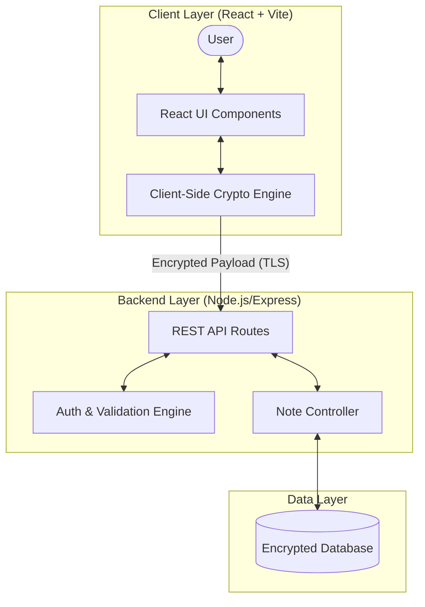

# 🔐 Secure Notes Platform

> A privacy-focused, end-to-end encrypted note-taking application designed for secure creation, management, and sharing of confidential notes.

[](https://www.typescriptlang.org/)
[](https://reactjs.org/)
[](https://vitejs.dev/)
[](https://nodejs.org/)
[](LICENSE)

---

## 📸 Visual Preview

```
┌─────────────────────────────────────────────────────────────────────────┐
│                                                                         │
│                    🔐 SECURE NOTES PLATFORM UI                          │
│                                                                         │
│   [ 📝 New Note ]    [ 🔍 Search Notes ]       [ ⚙️ Settings ]          │
│   ───────────────────────────────────────────────────────────────────   │
│   • Confidential Project Architecture (Encrypted)                      │
│   • Personal Vault Keys                                                 │
│   • Self-Destructing Passphrases                                       │
│                                                                         │
└─────────────────────────────────────────────────────────────────────────┘
```

---

## ✨ Features

- 🔒 **Zero-Knowledge Encryption**: Notes are encrypted prior to transmission, ensuring raw content remains confidential.
- ⚡ **Blazing Fast Performance**: Powered by **Vite** and **React** for seamless interaction and instant updates.
- 🛡️ **Type Safety**: Built with **TypeScript** across client and server logic for robust code reliability.
- ⏱️ **Ephemeral Notes**: Support for self-destructing or expiration-based note sharing.
- 🌐 **Restricted Access & Auth**: JWT-based authentication combined with secure server processing.
- 🎨 **Modern Minimalist UI**: Clean design optimized for focus and privacy.

---

## 📂 Repository Structure

```text
secure-notes-platform/
├── public/                  # Static assets and favicons
├── server/                  # Backend REST API and encryption utilities
├── src/                     # React frontend source code
│   ├── assets/              # Web assets and icons
│   ├── components/          # Reusable UI components
│   ├── hooks/               # Custom React hooks
│   ├── pages/               # Application view routes
│   └── utils/               # Crypto & helper functions
├── .gitignore               # Git exclude rules
├── eslint.config.js         # ESLint configuration
├── index.html               # Vite HTML entry point
├── package.json             # Dependencies and project scripts
├── package-lock.json        # NPM lockfile
├── tsconfig.app.json        # TypeScript config for frontend
├── tsconfig.json            # Root TypeScript configuration
├── tsconfig.node.json       # TypeScript config for Vite/Node environment
└── vite.config.ts           # Vite build tool configuration
```

---

## 🏗️ Architecture & Data Flow



---

## 🛠️ Tech Stack

| Domain | Technology | Description |
| :--- | :--- | :--- |
| **Frontend** | React 18, TypeScript | UI rendering & state management |
| **Build Tool** | Vite | Ultra-fast frontend bundling & dev server |
| **Backend** | Node.js, Express | Secure API layer and user management |
| **Tooling** | ESLint, TypeScript Config | Code quality, linting, and static analysis |

---

## 🚀 Quick Start / Installation

### Prerequisites
- **Node.js**: `v18.x` or higher
- **npm**: `v9.x` or higher

### Step 1: Clone the Repository
```bash
git clone https://github.com/auysh8/secure-notes-platform.git
cd secure-notes-platform
```

### Step 2: Install Dependencies
```bash
npm install
```

### Step 3: Configure Environment Variables
Create a `.env` file in the root directory based on the configuration guide below.

### Step 4: Run Development Server
```bash
# Start frontend and server concurrently
npm run dev
```

---

## ⚙️ Environment Variables

Create a `.env` file in the root directory:

```env
# Client Configuration
VITE_API_BASE_URL=http://localhost:5000/api

# Server Configuration
PORT=5000
NODE_ENV=development
JWT_SECRET=your_super_secret_jwt_key_here
ENCRYPTION_KEY=your_32_character_master_key_here
```

---

## 📖 Usage & Scripts

The following scripts are defined in `package.json`:

| Script | Command | Description |
| :--- | :--- | :--- |
| `dev` | `npm run dev` | Launches the Vite development server with HMR |
| `build` | `npm run build` | Compiles TypeScript and builds production bundles |
| `preview` | `npm run preview` | Serves the production build locally for verification |
| `lint` | `npm run lint` | Runs ESLint to inspect code formatting and error checking |

---

## 🤝 Contributing

Contributions are welcome! Please follow these steps:

1. **Fork** the repository.
2. Create a feature branch: `git checkout -b feature/amazing-feature`.
3. Commit your changes: `git commit -m 'Add amazing feature'`.
4. Push to the branch: `git push origin feature/amazing-feature`.
5. Open a **Pull Request**.

---

## 📄 License

This project is licensed under the **MIT License**. See the [LICENSE](LICENSE) file for more details.