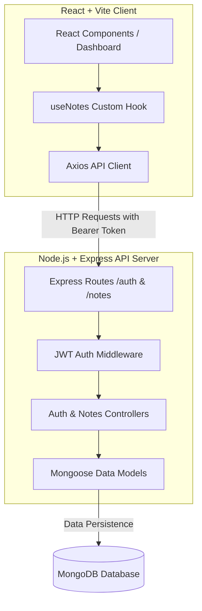

# Secure Notes Platform

An end-to-end full-stack notes management application built with TypeScript, React, Node.js, and Express. Designed for speed, security, and data privacy, featuring authenticated user workspaces, real-time search, tag filtering, and note lifecycle management (active, archived, trash).

[](https://reactjs.org/)
[](https://www.typescriptlang.org/)
[](https://vitejs.dev/)
[](https://nodejs.org/)
[](https://expressjs.com/)

---

## Deployments & Live Demo

- **Live Application (Vercel):** [https://notes-app-neon-eta.vercel.app](https://notes-app-neon-eta.vercel.app)
- **GitHub Repository:** [https://github.com/auysh8/secure-notes-platform](https://github.com/auysh8/secure-notes-platform)

---

## Visual Preview

| Dashboard | Authentication |
| :---: | :---: |
|  |  |

---

## Key Features

- **Secure Authentication:** Full user signup and login workflows protected by JWT tokens and server-side authentication middleware.
- **Rich Note Operations:** Create, edit, pin, color-tag, archive, restore, and permanently delete notes.
- **Instant Search & Filtering:** Client-side search across note titles and contents with sidebar view filtering.
- **Dedicated Workspaces:** Distinct views for active notes, pinned notes, archived items, and trash bin.
- **End-to-End Type Safety:** Fully typed across the entire stack using TypeScript for models, API payloads, and UI components.
- **Responsive Interface:** Modular CSS styling designed for seamless desktop and mobile interactions.

---

## Repository Structure

```text
secure-notes-platform/
├── server/
│   ├── controller/
│   │   ├── auth.controller.ts
│   │   └── notes.controller.ts
│   ├── middleware/
│   │   ├── auth.middleware.ts
│   │   └── error.middleware.ts
│   ├── models/
│   │   ├── note.model.ts
│   │   └── user.model.ts
│   ├── routes/
│   │   ├── auth.routes.ts
│   │   └── notes.routes.ts
│   ├── index.ts
│   └── tsconfig.json
├── src/
│   ├── components/
│   │   ├── Logo/
│   │   ├── New Note Button/
│   │   ├── Note Edit View/
│   │   ├── Notes Grid/
│   │   ├── Search bar/
│   │   └── Sidebar/
│   ├── dashboard/
│   │   └── Dashboard.tsx
│   ├── hooks/
│   │   └── useNotes.ts
│   ├── pages/
│   │   ├── AuthPage.tsx
│   │   └── LoadingPage.tsx
│   ├── services/
│   │   └── notesApi.ts
│   ├── App.tsx
│   ├── main.tsx
│   └── types.ts
├── index.html
├── package.json
├── tsconfig.json
├── vercel.json
└── vite.config.ts
```

---

## Architecture & Data Flow



---

## Tech Stack

| Category | Technologies |
| :--- | :--- |
| **Frontend** | React 18/19, TypeScript, Vite, React Router DOM, Framer Motion, CSS Modules |
| **Backend** | Node.js, Express, TypeScript, Mongoose ODM |
| **Database** | MongoDB / MongoDB Atlas |
| **Security** | JSON Web Tokens (JWT), bcryptjs password hashing, custom auth middleware |
| **Deployment** | Vercel (Frontend), Render / Railway (Backend) |

---

## Quick Start

### Prerequisites

- Node.js (v18.0.0 or higher)
- npm or pnpm
- MongoDB connection string

### Setup & Installation

1. **Clone the repository:**
   ```bash
   git clone https://github.com/auysh8/secure-notes-platform.git
   cd secure-notes-platform
   ```

2. **Install frontend dependencies:**
   ```bash
   npm install
   ```

3. **Install backend dependencies:**
   ```bash
   cd server
   npm install
   cd ..
   ```

4. **Configure environment variables:**

   Create `.env` in `server/`:
   ```env
   PORT=5000
   MONGO_URI=your_mongodb_connection_string
   JWT_SECRET=your_jwt_secret_key
   ```

   Create `.env` in the root frontend directory:
   ```env
   VITE_BACKEND_URL=http://localhost:5000
   ```

5. **Start development servers:**

   - **Backend:**
     ```bash
     cd server
     npm run dev
     ```

   - **Frontend (in a separate terminal):**
     ```bash
     npm run dev
     ```

6. Open `http://localhost:5173` in your browser.

---

## Available Scripts

### Frontend Scripts (Root)

| Command | Description |
| :--- | :--- |
| `npm run dev` | Starts Vite development server |
| `npm run build` | Builds production bundle into `dist` |
| `npm run preview` | Previews production build locally |
| `npm run lint` | Runs ESLint |

### Backend Scripts (`server/`)

| Command | Description |
| :--- | :--- |
| `npm run dev` | Runs Express server with live reload (`tsx watch`) |
| `npm run build` | Compiles TypeScript files |
| `npm start` | Runs compiled production server |

---

## License

This project is licensed under the MIT License.

---

## Author

**Pankaj Bhandari**
- GitHub: [https://github.com/auysh8](https://github.com/auysh8)
- LinkedIn: [https://linkedin.com/in/pankajbhandari2004](https://linkedin.com/in/pankajbhandari2004)
- Email: [pankajbhandari0714@gmail.com](mailto:pankajbhandari0714@gmail.com)
