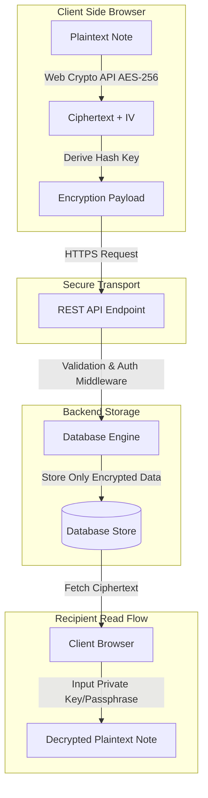

# Secure Notes Platform 🔒

An end-to-end encrypted, zero-knowledge note-taking application engineered for private document management, secure sharing, and sensitive information storage.


---

## 📸 Visual Preview

> 💡 Add a screenshot of your app at `docs/preview.png` to display it here.


---

## ✨ Features

- 🔐 **Zero-Knowledge Encryption**: Notes are encrypted client-side using Web Crypto API (AES-GCM 256-bit) before being transmitted to the server.
- ⏳ **Self-Destructing Notes**: Generate shareable links configured to automatically delete after reading or after a specified expiration time.
- 🔑 **Passphrase Protection**: Add secondary encryption keys to individual notes for extra security layers.
- 📝 **Markdown Editor**: Rich textual formatting with live markdown preview, syntax highlighting, and code snippet support.
- 🏷️ **Categorization & Search**: Organize encrypted documents using tags and local encrypted search indexing.
- 🛡️ **Session Integrity**: Secure authentication workflows featuring JWTs, protected routes, and automatic lockout timers.

---

## 📂 Repository Structure

```
secure-notes-platform/
├── client/
│   ├── public/
│   ├── src/
│   │   ├── components/
│   │   │   ├── auth/
│   │   │   ├── editor/
│   │   │   ├── layout/
│   │   │   └── notes/
│   │   ├── hooks/
│   │   ├── lib/
│   │   │   ├── api.ts
│   │   │   └── crypto.ts
│   │   ├── pages/
│   │   ├── types/
│   │   ├── App.tsx
│   │   └── main.tsx
│   ├── package.json
│   └── vite.config.ts
├── server/
│   ├── src/
│   │   ├── controllers/
│   │   ├── middleware/
│   │   ├── models/
│   │   ├── routes/
│   │   ├── utils/
│   │   └── index.ts
│   ├── package.json
│   └── tsconfig.json
├── .env.example
├── docker-compose.yml
└── README.md
```

---

## 🏗️ Architecture & Data Flow



---

## 🛠️ Tech Stack

| Category | Technologies |
| :--- | :--- |
| **Frontend** | React, TypeScript, Tailwind CSS, Lucide React, Vite |
| **Backend** | Node.js, Express.js, TypeScript |
| **Cryptography** | Web Crypto API (AES-GCM-256, PBKDF2), SHA-256 |
| **Database & Auth** | MongoDB / PostgreSQL, JSON Web Tokens (JWT), Bcrypt |
| **Tooling** | Docker, ESLint, Prettier, Nodemon |

---

## 🚀 Quick Start

### Prerequisites

Ensure you have the following installed on your machine:
- **Node.js**: `v18.x` or higher
- **npm** or **pnpm** / **yarn**
- **Git**

### Installation

1. **Clone the repository:**
   ```bash
   git clone https://github.com/auysh8/secure-notes-platform.git
   cd secure-notes-platform
   ```

2. **Install dependencies for server and client:**
   ```bash
   # Install root / server dependencies
   cd server
   npm install

   # Install client dependencies
   cd ../client
   npm install
   ```

3. **Configure Environment Variables:**
   Copy `.env.example` in both server and client root directories and customize the parameters.
   ```bash
   cp .env.example .env
   ```

4. **Run the Application in Development Mode:**

   *Start the Backend Server:*
   ```bash
   cd server
   npm run dev
   ```

   *Start the Frontend Application:*
   ```bash
   cd client
   npm run dev
   ```

   Navigate to `http://localhost:5173` in your browser.

---

## ⚙️ Environment Variables

Configure the following variables in your `.env` file:

```env
# Server Configuration
PORT=5000
NODE_ENV=development
DATABASE_URL=mongodb://localhost:27017/secure-notes
JWT_SECRET=your_super_secret_jwt_key_change_in_production
CORS_ORIGIN=http://localhost:5173

# Client Configuration
VITE_API_BASE_URL=http://localhost:5000/api
```

---

## 📖 Available Scripts

| Location | Script | Command | Description |
| :--- | :--- | :--- | :--- |
| `server/` | `dev` | `npm run dev` | Runs backend in development mode with live reload |
| `server/` | `build` | `npm run build` | Compiles TypeScript into JavaScript |
| `server/` | `start` | `npm run start` | Launches compiled production server |
| `client/` | `dev` | `npm run dev` | Starts Vite local development server |
| `client/` | `build` | `npm run build` | Builds client application for production |
| `client/` | `preview` | `npm run preview` | Previews production build locally |

---

## 🤝 Contributing

Contributions are welcome! Please follow these steps to contribute:

1. **Fork** the Repository.
2. **Create** a feature branch: `git checkout -b feature/AmazingFeature`.
3. **Commit** your changes: `git commit -m 'Add some AmazingFeature'`.
4. **Push** to the branch: `git push origin feature/AmazingFeature`.
5. **Open** a Pull Request.

---

## 📄 License

Distributed under the MIT License. See `LICENSE` for more information.