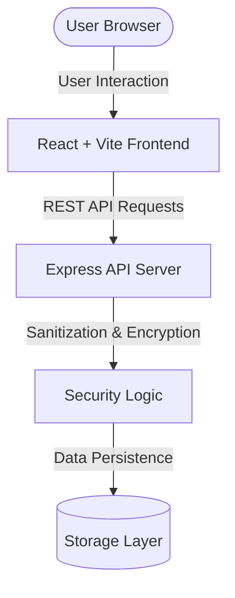

# Secure Notes Platform 🔐

A privacy-focused, full-stack web application designed for creating, managing, and storing encrypted notes securely. Built with React, Vite, TypeScript, and a Node.js backend.


---

## ✨ Features

- 🔒 **End-to-End Privacy**: Safeguard sensitive text and confidential information with client-server security protocols.
- ⚡ **High Performance**: Vite-powered client delivering instant server start and lightning-fast HMR (Hot Module Replacement).
- 🛡️ **Type-Safe Development**: Full TypeScript implementation across both client and server codebases.
- 🌐 **Dedicated Express API**: Decoupled server layer managing API routes, encryption routines, and persistence logic.
- 🎨 **Modern UI**: Clean, responsive user interface tailored for fast note taking and viewing.

---

## 🏗️ Architecture & Data Flow



---

## 🛠️ Tech Stack

- **Frontend**: React, TypeScript, Vite
- **Backend**: Node.js, Express
- **Code Quality**: ESLint, TypeScript Compiler (`tsc`)
- **Package Manager**: npm

---

## 🚀 Quick Start

### Prerequisites

Ensure you have the following installed on your machine:
- [Node.js](https://nodejs.org/) (v18.0.0 or higher)
- [npm](https://www.npmjs.com/) (v9.0.0 or higher)

### Step-by-Step Setup

1. **Clone the Repository**
   ```bash
   git clone https://github.com/auysh8/secure-notes-platform.git
   cd secure-notes-platform
   ```

2. **Install Dependencies**
   ```bash
   npm install
   ```

3. **Configure Environment Variables**
   Create a `.env` file in the root directory (see section below for reference).

4. **Run the Development Server**
   ```bash
   npm run dev
   ```
   Open your browser and navigate to `http://localhost:5173`.

---

## ⚙️ Environment Variables

Create a `.env` file in the root directory to set up your environment variables:

```env
# Client Configuration
VITE_API_BASE_URL=http://localhost:3000/api

# Server Configuration
PORT=3000
NODE_ENV=development
```

---

## 📖 Usage & Scripts

The following npm scripts are available in `package.json`:

| Script | Description |
| :--- | :--- |
| `npm run dev` | Starts the Vite development server for the frontend app. |
| `npm run build` | Compiles TypeScript and builds production assets. |
| `npm run lint` | Runs ESLint across the codebase to ensure formatting and code style. |
| `npm run preview` | Locally previews the production build output. |

---

## 🤝 Contributing

Contributions are welcome! To contribute:

1. Fork the repository.
2. Create your feature branch (`git checkout -b feature/AmazingFeature`).
3. Commit your changes (`git commit -m 'Add some AmazingFeature'`).
4. Push to the branch (`git push origin feature/AmazingFeature`).
5. Open a Pull Request.

---

## 📄 License

This project is licensed under the [MIT License](LICENSE).